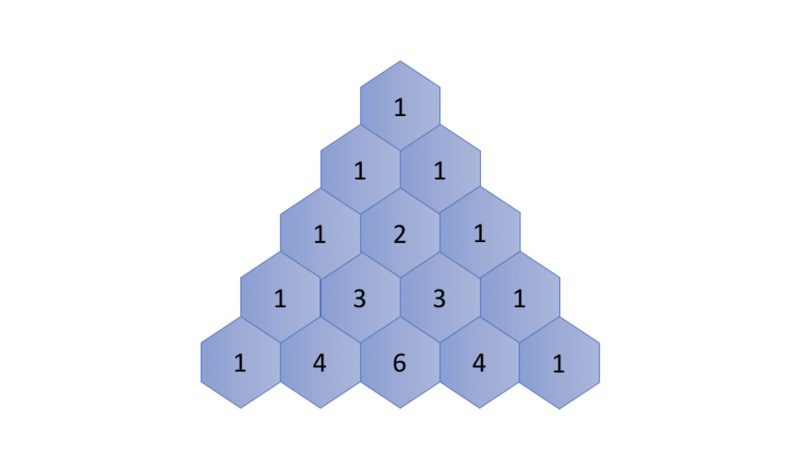

# Recursion

> Recursion is an approach to solving problems using a function that calls itself as a subroutine.

You might wonder how we can implement a function that calls itself. The trick is that each time a recursive function calls itself, it reduces the given problem into sub-problems. The recursion call continues until it reaches a point where the sub-problem can be solved without further recursion.

A recursive function should have the following properties so that it does not result in an infinite loop:

1. A simple `base case` \(or cases\) — a terminating scenario that does not use recursion to produce an answer.
2. A set of rules, also known as `recurrence relation` that reduces all other cases towards the base case.

Note that there could be multiple places where the function may call itself.

#### Example <a id="example"></a>

Let's start with a simple programming problem:

> Print a string in reverse order.

You can easily solve this problem iteratively, _i.e._ looping through the string starting from its last character. But how about solving it recursively?

First, we can define the desired function as `printReverse(str[0...n-1])`, where `str[0]` represents the first character in the string. Then we can accomplish the given task in two steps:

1. `printReverse(str[1...n-1])`: print the sub-string `str[1...n-1]` in reverse order.
2. `print(str[0])`: print the first character in the string.

Notice that we call the function itself in the first step, which by definition makes the function recursive.

Here is the code snippet:



```cpp
void printReverse(const char *str) {
  if (!*str)
    return;
  printReverse(str + 1);
  putchar(*str);
}
```



```java
private static void printReverse(char [] str) {
  helper(0, str);
}

private static void helper(int index, char [] str) {
  if (str == null || index >= str.length) {
    return;
  }
  helper(index + 1, str);
  System.out.print(str[index]);
}
```



## Recursion Function

For a problem, if there exists a recursive solution, we can follow the guidelines below to implement it. 

For instance, we define the problem as the function `F(X)` to implement, where `X` is the input of the function which also defines the scope of the problem.

Then, in the function `F(X)`, we will:

1. Break the problem down into smaller scopes, such as `x0 ∈ X, x1∈ X ,..., xn ∈ X` 
2. Call function `F(x0), F(x1),...,F(xn)` _**recursively**_ to solve the sub-problems of `X`
3. Finally, process the results from the recursive function calls to solve the problem corresponding to `X.`

#### Example

To showcase the above guidelines, we give another example on how to solve a problem recursively. 

> Given a linked list, swap every two adjacent nodes and return its head.
>
> _e.g._  for a list 1-&gt; 2 -&gt; 3 -&gt; 4, one should return the head of list as 2 -&gt; 1 -&gt; 4 -&gt; 3.

We define the function to implement as `swap(head)`, where the input parameter `head` refers to the head of a linked list. The function should return the `head` of the new linked list that has any adjacent nodes swapped.

Following the guidelines we lay out above, we can implement the function as follows:

1. First, we swap the first two nodes in the list, _i.e._ `head` and `head.next`;
2. Then, we call the function self as `swap(head.next.next)` to swap the rest of the list following the first two nodes.
3. Finally, we attach the returned head of the sub-list in step \(2\) with the two nodes swapped in step \(1\) to form a new linked list.

## Recurrence Relation


There are two important things that one needs to figure out before implementing a recursive function:

* `recurrence relation`: the relationship between the result of a problem and the result of its sub-problems.
* `base case`: the case where one can compute the answer directly without any further recursion calls. Sometimes, the base cases are also called _bottom cases_, since they are often the cases where the problem has been reduced to the minimal scale, i.e. the bottom, if we consider that dividing the problem into sub-problems is in a top-down manner.

> Once we figure out the above two elements, to implement a recursive function we simply call the function itself according to the `recurrence relation` until we reach the `base case`.

To explain the above points, let's look at a classic problem, `Pascal's Triangle`:

> Pascal's triangle are a series of numbers arranged in the shape of triangle. In Pascal's triangle, the leftmost and the rightmost numbers of each row are always 1. For the rest, each number is the sum of the two numbers directly above it in the previous row.



#### Recurrence Relation <a id="recurrence-relation"></a>

 Let's start with the recurrence relation within the Pascal's Triangle.

First of all, we define a function `f(i,j)` which returns the number in the Pascal's Triangle in the `i-th` row and `j-th` column.

We then can represent the recurrence relation with the following formula:`f(i,j) = f(i−1,j−1) + f(i−1,j)` 

#### Base Case <a id="base-case"></a>

As one can see, the leftmost and rightmost numbers of each row are the `base cases` in this problem, which are always equal to 1.

As a result, we can define the base case as follows: `f(i,j) = 1 where j = 1 or j = i` 

As one can see, once we define the `recurrence relation` and the `base case`, it becomes much more intuitive to implement the recursive function, especially when we formulate these two elements in terms of mathematical formulas.

Starting from `f(5,3)` , we can break it down as `f(5,3)=f(4,2)+f(4,3)`, we then call `f(4,2)` and `f(4,3`\) recursively:

* For the call of `f(4,2)`, we could extend it further until we reach the base cases, as follows:`f(4, 2) = f(3, 1) + f(3, 2) = f(3, 1) + (f(2, 1) + f(2, 2)) = 1 + (1 + 1) = 3`
* For the call of `f(4,3)`, similarly we break it down as: `f(4, 3) = f(3, 2) + f(3, 3) = (f(2, 1) + f(2, 2)) + f(3, 3) = (1 + 1) + 1 = 3`
* Finally we combine the results of the above sub-problems: `f(5, 3) = f(4, 2) + f(4, 3) = 3 + 3 = 6`

In the above example, you might have noticed that the recursive solution can incur some duplicate calculations, _i.e._ we compute the same intermediate numbers repeatedly in order to obtain numbers in the last row. For instance, in order to obtain the result for the number `f(5,3)`, we calculate the number `f(3,2)` twice both in the calls of `f(4, 2)` and `f(4,3)`.

We will discuss how to avoid these `duplicate calculations` in memoization chapter

