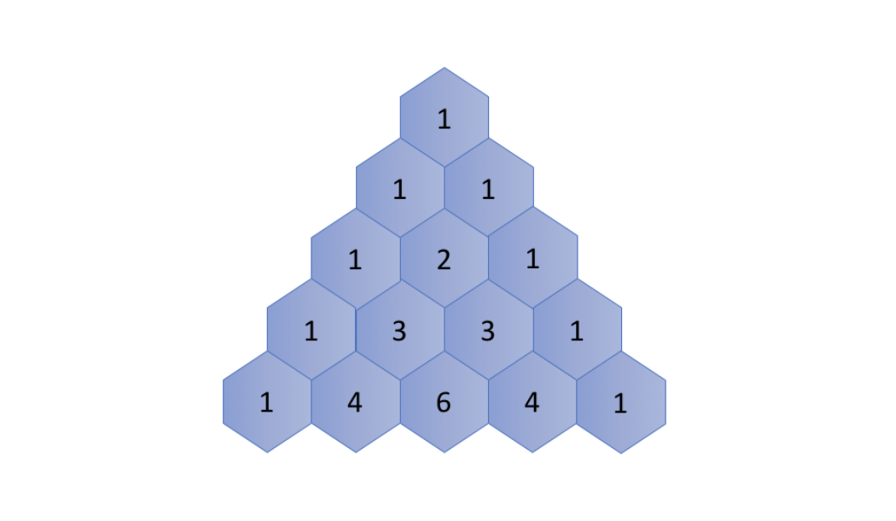

# Recursion I

> Recursion is an approach to solving problems using a function that calls itself as a subroutine.

You might wonder how we can implement a function that calls itself. The trick is that each time a recursive function calls itself, it reduces the given problem into sub-problems. The recursion call continues until it reaches a point where the sub-problem can be solved without further recursion.

A recursive function should have the following properties so that it does not result in an infinite loop:

1. A simple `base case` (or cases) — a terminating scenario that does not use recursion to produce an answer.
2. A set of rules, also known as `recurrence relation` that reduces all other cases towards the base case.

Note that there could be multiple places where the function may call itself.

#### Example <a href="example" id="example"></a>

Let's start with a simple programming problem:

> Print a string in reverse order.

You can easily solve this problem iteratively, _i.e._ looping through the string starting from its last character. But how about solving it recursively?

First, we can define the desired function as `printReverse(str[0...n-1])`, where `str[0]` represents the first character in the string. Then we can accomplish the given task in two steps:

1. `printReverse(str[1...n-1])`: print the sub-string `str[1...n-1]` in reverse order.
2. `print(str[0])`: print the first character in the string.

Notice that we call the function itself in the first step, which by definition makes the function recursive.

Here is the code snippet:



```cpp
void printReverse(const char *str) {
  if (!*str)
    return;
  printReverse(str + 1);
  putchar(*str);
}
```



```java
private static void printReverse(char [] str) {
  helper(0, str);
}

private static void helper(int index, char [] str) {
  if (str == null || index >= str.length) {
    return;
  }
  helper(index + 1, str);
  System.out.print(str[index]);
}
```



## Recursion Function

For a problem, if there exists a recursive solution, we can follow the guidelines below to implement it. 

For instance, we define the problem as the function` F(X)` to implement, where` X` is the input of the function which also defines the scope of the problem.

Then, in the function `F(X)`, we will:

1. Break the problem down into smaller scopes, such as `x0 ∈ X, x1∈ X ,..., xn ∈ X `
2. Call function `F(x0), F(x1),...,F(xn)` _**recursively**_ to solve the sub-problems of `X`
3. Finally, process the results from the recursive function calls to solve the problem corresponding to `X.`

#### Example

To showcase the above guidelines, we give another example on how to solve a problem recursively. 

> Given a linked list, swap every two adjacent nodes and return its head.
>
> _e.g._  for a list 1-> 2 -> 3 -> 4, one should return the head of list as 2 -> 1 -> 4 -> 3.

We define the function to implement as `swap(head)`, where the input parameter `head` refers to the head of a linked list. The function should return the `head` of the new linked list that has any adjacent nodes swapped.

Following the guidelines we lay out above, we can implement the function as follows:

1. First, we swap the first two nodes in the list, _i.e._ `head` and `head.next`;
2. Then, we call the function self as `swap(head.next.next)` to swap the rest of the list following the first two nodes.
3. Finally, we attach the returned head of the sub-list in step (2) with the two nodes swapped in step (1) to form a new linked list.

## Recurrence Relation


There are two important things that one needs to figure out before implementing a recursive function:

* `recurrence relation`: the relationship between the result of a problem and the result of its sub-problems.
* `base case`: the case where one can compute the answer directly without any further recursion calls. Sometimes, the base cases are also called _bottom cases_, since they are often the cases where the problem has been reduced to the minimal scale, i.e. the bottom, if we consider that dividing the problem into sub-problems is in a top-down manner.

> Once we figure out the above two elements, to implement a recursive function we simply call the function itself according to the `recurrence relation` until we reach the `base case`.

To explain the above points, let's look at a classic problem, `Pascal's Triangle`:

> Pascal's triangle are a series of numbers arranged in the shape of triangle. In Pascal's triangle, the leftmost and the rightmost numbers of each row are always 1. For the rest, each number is the sum of the two numbers directly above it in the previous row.



#### Recurrence Relation <a href="recurrence-relation" id="recurrence-relation"></a>

 Let's start with the recurrence relation within the Pascal's Triangle.

First of all, we define a function` f(i,j)` which returns the number in the Pascal's Triangle in the `i-th` row and `j-th` column.

We then can represent the recurrence relation with the following formula:`f(i,j) = f(i−1,j−1) + f(i−1,j) `

#### Base Case <a href="base-case" id="base-case"></a>

As one can see, the leftmost and rightmost numbers of each row are the `base cases` in this problem, which are always equal to 1.

As a result, we can define the base case as follows: `f(i,j) = 1 where j = 1 or j = i `

As one can see, once we define the `recurrence relation` and the `base case`, it becomes much more intuitive to implement the recursive function, especially when we formulate these two elements in terms of mathematical formulas.

Starting from `f(5,3)` , we can break it down as `f(5,3)=f(4,2)+f(4,3)`, we then call `f(4,2) `and `f(4,3`) recursively:

* For the call of `f(4,2)`, we could extend it further until we reach the base cases, as follows:`f(4, 2) = f(3, 1) + f(3, 2) = f(3, 1) + (f(2, 1) + f(2, 2)) = 1 + (1 + 1) = 3`
* For the call of `f(4,3)`, similarly we break it down as: `f(4, 3) = f(3, 2) + f(3, 3) = (f(2, 1) + f(2, 2)) + f(3, 3) = (1 + 1) + 1 = 3`
* Finally we combine the results of the above sub-problems: `f(5, 3) = f(4, 2) + f(4, 3) = 3 + 3 = 6`

In the above example, you might have noticed that the recursive solution can incur some duplicate calculations, _i.e._ we compute the same intermediate numbers repeatedly in order to obtain numbers in the last row. For instance, in order to obtain the result for the number `f(5,3)`, we calculate the number `f(3,2)` twice both in the calls of `f(4, 2)` and` f(4,3)`.

We will discuss how to avoid these `duplicate calculations `in memoization chapter

## Duplicate Calculation in Recursion

Recursion is often an intuitive and powerful way to implement an algorithm. However, it might bring some undesired penalty to the performance, _e.g._ duplicate calculations, if we do not use it wisely. For instance, at the end of the previous chapter, we have encountered the duplicate calculations problem in Pascal's Triangle, where some intermediate results are calculated multiple times.

In this article we will look closer into the duplicate calculations problem that could happen with recursion. We will then propose a common technique called `memoization` that can be used to avoid this problem.

To demonstrate another problem with duplicate calculations, let's look at an example that most people might be familiar with, the [Fibonacci number](https://en.wikipedia.org/wiki/Fibonacci_number). If we define the function `F(n)` to represent the Fibonacci number at the index of `n`, then you can derive the following recurrence relation:

`F(n) = F(n - 1) + F(n - 2) `with the base cases:`F(0) = 0, F(1) = 1`

Given the definition of a Fibonacci number, one can implement the function as follows:



```java
public static int fibonacci(int n) {
  if (n < 2) {
    return n;
  } else {
    return fibonacci(n-1) + fibonacci(n-2);
  }
}
```



```python
def fibonacci(n):
    """
    :type n: int
    :rtype: int
    """
    if n < 2:
        return n
    else:
        return fibonacci(n-1) + fibonacci(n-2)
```



Now, if you would like to know the number of `F(4)`, you can apply and extend the above formulas as follows: `F(4) = F(3) + F(2) = (F(2) + F(1)) + F(2)`

As you can see, in order to obtain the result for `F(4)`, we would need to calculate the number `F(2)` twice following the above deduction: the first time in the first extension of `F(4)` and the second time for the intermediate result `F(3)`.

Here is the tree that shows all the duplicate calculations (grouped by colors) that occur during the calculation of `F(4)`.


#### Memoization <a href="memoization" id="memoization"></a>

To eliminate the duplicate calculation in the above case, as many of you would have figured out, one of the ideas would be to **store** the intermediate results in the cache so that we could reuse them later without re-calculation.

This idea is also known as _memoization_, which is a technique that is frequently used together with recursion.

> [Memoization](https://en.wikipedia.org/wiki/Memoization) is an optimization technique used primarily to **speed up** computer programs by **storing** the results of expensive function calls and returning the cached result when the same inputs occur again. (Source: wikipedia)

Back to our Fibonacci function `F(n)`. We could use a hash table to keep track of the result of each `F(n)` with `n` as the key. The hash table serves as a cache that saves us from duplicate calculations. The **memoization technique is a good example that demonstrates how one can reduce compute time in exchange for some additional space.**

For the sake of comparison, we provide the implementation of Fibonacci number solution with memoization below.



```java
import java.util.HashMap;

public class Main {

  HashMap<Integer, Integer> cache = new HashMap<Integer, Integer>();

  private int fib(int N) {
    if (cache.containsKey(N)) {
      return cache.get(N);
    }
    int result;
    if (N < 2) {
      result = N;
    } else {
      result = fib(N-1) + fib(N-2);
    }
    // keep the result in cache.
    cache.put(N, result);
    return result;
  }
}
```



```python
def fib(self, N):
    """
    :type N: int
    :rtype: int
    """
    cache = {}
    def recur_fib(N):
        if N in cache:
            return cache[N]

        if N < 2:
            result = N
        else:
            result = recur_fib(N-1) + recur_fib(N-2)

        # put result in cache for later reference.
        cache[N] = result
        return result

    return recur_fib(N)
```



## Time Complexity - Recursion

Let us focus on how to calculate the time complexity for recursion algorithms.

> Given a recursion algorithm, its time complexity O(T) is typically the product of **the number of recursion** _**invocations**_ (denoted as R and **the time complexity of calculation** (denoted as O(s)) that incurs along with each recursion call: O(T) = R \* O(s) 

Let's take a look at some examples below.

#### Example

As you might recall, in the problem of [printReverse](https://leetcode.com/explore/learn/card/recursion-i/250/principle-of-recursion/1439/), we are asked to print the string in the reverse order. A recurrence relation to solve the problem can be expressed as follows:

`printReverse(str) = printReverse(str[1...n]) + print(str[0])`

where `str[1...n]` is the sub-string of the input string `str`, without the leading character `str[0]`.

As you can see, the function would be recursively invoked `n` times, where `n` is the size of the input string. At the end of each recursion, we simply print the leading character, therefore the time complexity of this particular operation is constant, _i.e. _O(1) .

To sum up, the overall time complexity of our recursive function `printReverse(str)` would be `O(printReverse) = n * O(1) = O(n)`

#### Execution Tree

For recursive functions, it is rarely the case that the number of recursion calls happens to be linear to the size of input. For example, one might recall the example of [Fibonacci number](https://leetcode.com/explore/learn/card/recursion-i/255/recursion-memoization/1661/) that we discussed earlier, whose recurrence relation is defined as `f(n) = f(n-1) + f(n-2)`. At first glance, it does not seem straightforward to calculate the number of recursion invocations during the execution of the Fibonacci function.

> In this case, it is better resort to the _**`execution tree`**_, which is a tree that is used to denote the execution flow of a recursive function in particular. Each node in the tree represents an invocation of the recursive function. Therefore, the total number of nodes in the tree corresponds to the number of recursion calls during the execution.

The execution tree of a recursive function would form an `n-ary tree`, with `n` as the number of times recursion appears in the recurrence relation. For instance, the execution of the Fibonacci function would form a _**binary tree**_, as one can see from the following graph which shows the execution tree for the calculation of Fibonacci number `f(4)`.


In a full binary tree with `n` levels, the total number of nodes would be `2^(n −1)`. Therefore, the upper bound (though not tight) for the number of recursion in `f(n)` would be `2^(n -1)`, as well. As a result, we can estimate that the time complexity for `f(n)` would be `O(2^n)`.

#### Memoization

In the previous chapter, we discussed the technique of memoization that is often applied to optimize the time complexity of recursion algorithms. **By caching and reusing the intermediate results, memoization can greatly reduce the number of recursion calls, **_**i.e.**_** reducing the number of branches in the execution tree.** One should take this reduction into account when analyzing the time complexity of recursion algorithms with memoization.

Let's get back to our example of Fibonacci number. With memoization, we save the result of Fibonacci number for each index `n`. We are assured that the calculation for each Fibonacci number would occur only once. And we know, from the recurrence relation, the Fibonacci number `f(n)` would depend on all `n-1` precedent Fibonacci numbers. As a result, the recursion to calculate `f(n)` would be invoked `n-1` times to calculate all the precedent numbers that it depends on. 

Now, we can simply apply the formula we introduced in the beginning of this chapter to calculate the time complexity, which is `O(1)* n = O(n)`. Memoization not only optimizes the time complexity of algorithm, but also simplifies the calculation of time complexity.

## Space Complexity - Recursion

Let us see how to analyze the space complexity of a recursive algorithm.

> There are mainly two parts of the space consumption that one should bear in mind when calculating the space complexity of a recursive algorithm: `recursion related` and `non-recursion related space.`

### Recursion Related Space

The recursion related space refers to the memory cost that is incurred directly by the recursion, _i.e._ the stack to keep track of recursive function calls. In order to complete a typical function call, the system allocates some space in the stack to hold three important pieces of information:

1. The returning address of the function call. Once the function call is completed, the program must know where to return to, _i.e._ the line of code after the function call.
2. The parameters that are passed to the function call. 
3. The local variables within the function call.

This space in the stack is the minimal cost that is incurred during a function call. However, once the function call is done, this space is freed. 

For recursive algorithms, the function calls chain up successively until they reach a `base case` (_a.k.a._ bottom case). This implies that the space that is used for each function call is accumulated.

> For a recursive algorithm, if there is no other memory consumption, then this recursion incurred space will be the space upper-bound of the algorithm.

For example, in the exercise of [printReverse](https://leetcode.com/explore/learn/card/recursion-i/250/principle-of-recursion/1439/), we don't have extra memory usage outside the recursive call, since we simply print a character. For each recursive call, let's assume it can use space up to a constant value. And the recursive calls will chain up to `n` times, where `n` is the size of the input string. So the space complexity of this recursive algorithm is`O(n)`.

To illustrate this, for a sequence of recursive calls `f(x1) -> f(x2) -> f(x3)`, we show the sequence of execution steps along with the layout of the stack:


A space in the stack will be allocated for `f(x1)` in order to call `f(x2)`. Similarly in `f(x2)`, the system will allocate another space for the call to `f(x3)`. Finally in `f(x3)`, we reach the base case, therefore there is no further recursive call within `f(x3)`.

It is due to recursion-related space consumption that sometimes one might run into a situation called [stack overflow](https://en.wikipedia.org/wiki/Stack_overflow), where the stack allocated for a program reaches its maximum space limit and the program crashes. Therefore, **when designing a recursive algorithm, one should carefully check if there is a possibility of stack overflow when the input scales up.**

### Non-Recursion Related Space

As suggested by the name, the non-recursion related space refers to the memory space that is not directly related to recursion, which typically includes the space (normally in heap) that is allocated for the global variables.

Recursion or not, you might need to store the input of the problem as global variables, before any subsequent function calls. And you might need to save the intermediate results from the recursive calls as well. The latter is also known as _**memoization**_ as we saw in the previous chapters. For example, in the recursive algorithm with memoization to solve the Fibonacci number problem, we used a map to keep track of all intermediate Fibonacci numbers that occurred during the recursive calls. Therefore, in the space complexity analysis, we must take the space cost incurred by the memoization into consideration.  

## Tail Recursion

In the previous chapter, we talked about the implicit extra space incurred on the system stack due to recursion calls. However, you should learn to identify a special case of recursion called [tail recursion](https://en.wikipedia.org/wiki/Tail_call), which is **exempted** from this space overhead.

> **Tail recursion** is a recursion where the recursive call is the final instruction in the recursion function. And there should be only **one** recursive call in the function.

We have already seen an example of tail recursion in the solution of [Reverse String](https://leetcode.com/explore/learn/card/recursion-i/250/principle-of-recursion/1679/). Here is another example that shows the difference between non-tail-recursion and tail-recursion. Notice that in the non-tail-recursion example there is an extra computation after the very last recursive call.



```java
public class Main {
    
  private static int helper_non_tail_recursion(int start, int [] ls) {
    if (start >= ls.length) {
      return 0;
    }
    // not a tail recursion because it does some computation after the recursive call returned.
    return ls[start] + helper_non_tail_recursion(start+1, ls);
  }

  public static int sum_non_tail_recursion(int [] ls) {
    if (ls == null || ls.length == 0) {
      return 0;
    }
    return helper_non_tail_recursion(0, ls);
  }

  //---------------------------------------------

  private static int helper_tail_recursion(int start, int [] ls, int acc) {
    if (start >= ls.length) {
      return acc;
    }
    // this is a tail recursion because the final instruction is the recursive call.
    return helper_tail_recursion(start+1, ls, acc+ls[start]);
  }
    
  public static int sum_tail_recursion(int [] ls) {
    if (ls == null || ls.length == 0) {
      return 0;
    }
    return helper_tail_recursion(0, ls, 0);
  }
}
```



```python
def sum_non_tail_recursion(ls):
    """
    :type ls: List[int]
    :rtype: int, the sum of the input list.
    """
    if len(ls) == 0:
        return 0
    
    # not a tail recursion because it does some computation after the recursive call returned.
    return ls[0] + sum_non_tail_recursion(ls[1:])


def sum_tail_recursion(ls):
    """
    :type ls: List[int]
    :rtype: int, the sum of the input list.
    """
    def helper(ls, acc):
        if len(ls) == 0:
            return acc
        # this is a tail recursion because the final instruction is a recursive call.
        return helper(ls[1:], ls[0] + acc)
    
    return helper(ls, 0)
```



The benefit of having tail recursion is that it could avoid the accumulation of stack overheads during the recursive calls, since the system could reuse a fixed amount space in the stack for each recursive call. 

For example, for the sequence of recursion calls `f(x1) -> f(x2) -> f(x3)`, if the function `f(x)` is implemented as tail recursion, then here is the sequence of execution steps along with the layout of the stack:


Note that** in tail recursion, we know that as soon as we return from the recursive call we are going to immediately return as well, so we can skip the entire chain of recursive calls returning and return straight to the original caller. That means we don't need a call stack at all for all of the recursive calls, which saves us space.**

For example, in step (1), a space in the stack would be allocated for `f(x1)` in order to call `f(x2)`. Then in step (2), the function `f(x2)` would recursively call `f(x3)`. However, instead of allocating new space on the stack, the system could simply reuse the space allocated earlier for this second recursion call. Finally, in the function `f(x3)`, we reach the base case, and the function could simply return the result to the original caller without going back to the previous function calls.

A tail recursion function can be executed as non-tail-recursion functions, _i.e._ with piles of call stacks, without impact on the result. Often, the compiler recognizes tail recursion pattern, and optimizes its execution. However, not all programming languages support this optimization. For instance, **C, C++ support the optimization of tail recursion functions. On the other hand, Java and Python do not support tail recursion optimization.**

## **Conclusion**

Now, you might be convinced that recursion is indeed a powerful technique that allows us to solve many problems in an elegant and efficient way. But still, it is no silver bullet. Not every problem can be solved with recursion, due to the time or space constraints. And recursion itself might come with some undesired side effects such as stack overflow. 

In this chapter we would like to share a few more tips on how to better apply recursion to solve problems in the real world. 

> When in doubt, write down the **recurrence relationship**.

Sometimes, at a first glance it is not evident that a recursion algorithm can be applied to solve a problem. However, it is always helpful to deduct some relationships with the help of mathematical formulas, since the recurrence nature in recursion is quite close to the mathematics that we are familiar with. Often, they can clarify the ideas and uncover the hidden `recurrence relationship`. **Y**ou can find a fun example [Unique Binary Search Trees II](https://leetcode.com/explore/featured/card/recursion-i/253/conclusion/2384/), which can be solved by recursion, with the help of mathematical formulas. 

> Whenever possible, apply **memoization**.

When drafting a recursion algorithm, one could start with the most naive strategy. Sometimes, one might end up with the situation where there might be `duplicate calculation` during the recursion, _e.g._ Fibonacci numbers. In this case, you can try to apply the memoization technique, which stores the intermediate results in cache for later reuse. Memoization could greatly improve the time complexity with a bit of trade on space complexity, since it could avoid the expensive duplicate calculation.

> When stack overflows, **tail recursion** might come to help. 

There are often several ways to implement an algorithm with recursion. Tail recursion is a specific form of recursion that we could implement. Different from the memoization technique, tail recursion could optimize the _space_ complexity of the algorithm, by eliminating the stack overhead incurred by recursion. More importantly, with tail recursion, one could avoid the problem of `stack overflow` that comes often with recursion. Another advantage about tail recursion is that often times it is easier to read and understand, compared to non-tail-recursion. Because there is no post-call dependency in tail recursion (_i.e._ the recursive call is the final action in the function), unlike non-tail-recursion. Therefore, whenever possible, one should strive to apply the tail recursion.


