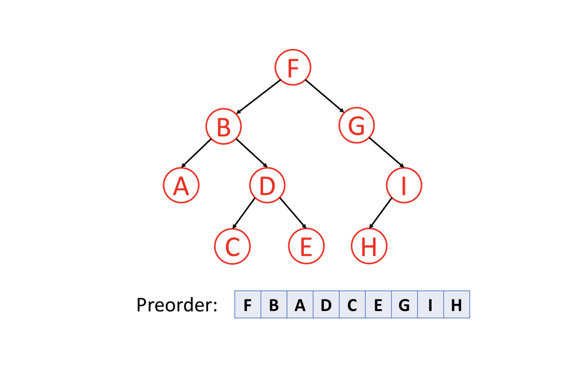
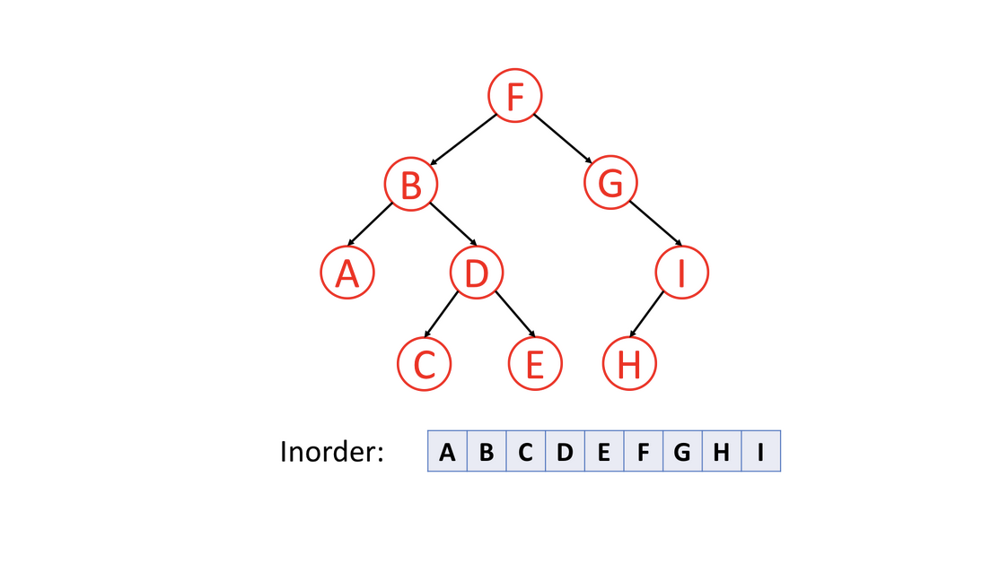
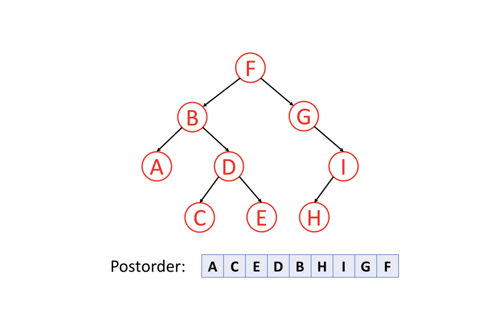

# Binary Tree Theory

A `tree` is a frequently-used data structure to simulate a hierarchical tree structure.

Each node of the tree will have a root value and a list of references to other nodes which are called child nodes. From graph view, a tree can also be defined as a directed acyclic graph which has `N nodes` and `N-1 edges`.

 A `Binary Tree` is one of the most typical tree structure. As the name suggests, a binary tree is a tree data structure in which each node has `at most two children`, which are referred to as the left child and the right child.

## Tree Traversal

### Pre Order Traversal

Pre-order traversal is to visit the root first. Then traverse the left subtree. Finally, traverse the right subtree. Here is an example:

### In Order Traversal

In-order traversal is to traverse the left subtree first. Then visit the root. Finally, traverse the right subtree. Typically, for `binary search tree`, we can retrieve all the data in sorted order using in-order traversal.

### Post Order Traversal

Post-order traversal is to traverse the left subtree first. Then traverse the right subtree. Finally, visit the root.

It is worth noting that when you delete nodes in a tree, deletion process will be in post-order. That is to say, when you delete a node, you will delete its left child and its right child before you delete the node itself.

Also, post-order is widely use in mathematical expression. It is easier to write a program to parse a post-order expression. Here is an example:

You can easily figure out the original expression using the inorder traversal. However, it is not easy for a program to handle this expression since you have to check the priorities of operations.

If you handle this tree in postorder, you can easily handle the expression using a stack. Each time when you meet a operator, you can just pop 2 elements from the stack, calculate the result and push the result back into the stack.

