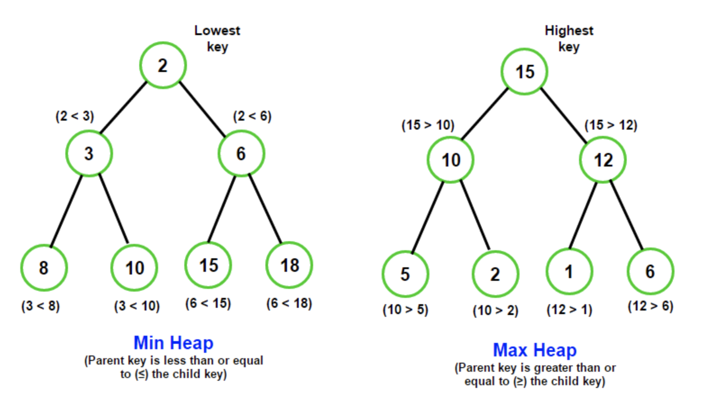
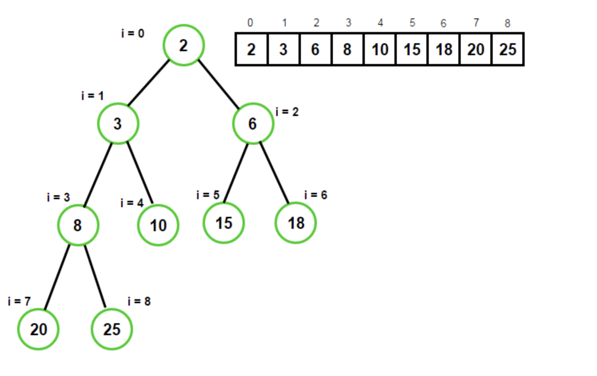
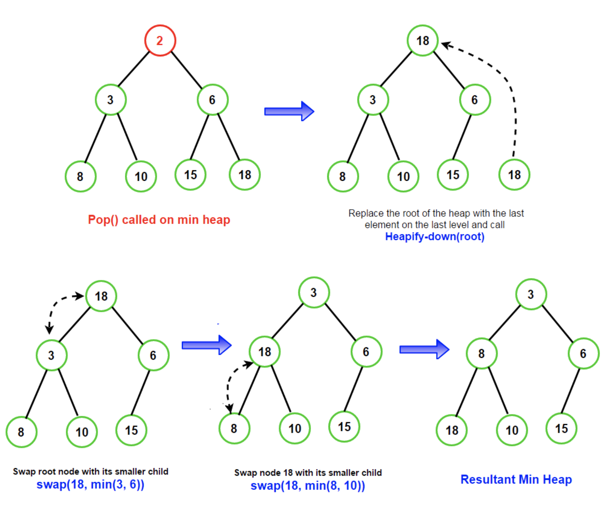
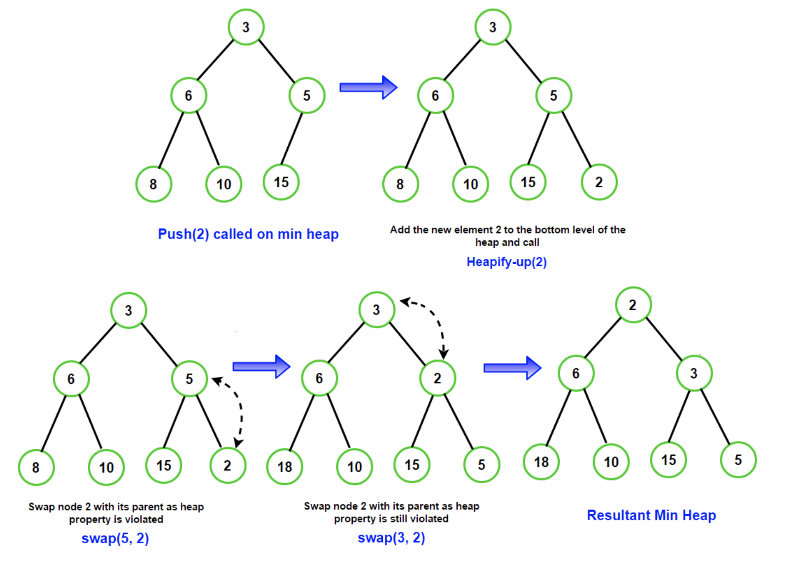

# Heap / Priority Queues

## Heap

A Heap is a special-tree based structure in which the tree is a complete tree. Although, in general, a heap node can have any number of children, we see heap being used as binary heap in most cases.

A Heap data structure should not be confused with the heap, a pool of memory used for dynamic memory allocation. The common implementation of Heap is the binary heap, which is basically a binary tree with two additional properties

* **Structural property :** A binary heap is a complete binary tree, i.e., all levels of the tree, except possibly the last one \(deepest\) are fully filled, and, if the last level of the tree is not complete, the nodes of that level are filled from left to right.
* **Heap property:** The key stored in each node is either "greater than or equal to" \(max-heap\)  or "lesser than or equal to" \(min-heap\) the keys in the node's children.

#### Min Heap and Max Heap

A heap can be classified further into "max-heap" or "min-heap".

* In a max-heap, the keys of parent nodes are always greater than or equal to those of the children, and the highest key is in the root rode.
* In a min-heap, the keys of parent nodes are less than or equal to those of the children, and the lowest key is in the root node.

Binary heaps have the smallest possible height of log\(n\), where n is the total number of nodes in a heap.



### Operations on Heap

A binary heap is a complete binary tree, but we usually never use a binary tree for implementing heaps. We store keys in an array and use their relative positions within that array to represent child-parent relationships. The following diagram shows an array representing a min-heap:



The complete binary tree maps the binary tree structure into the array indices, where each array index represents a node. The index of left or the right child or parent node is simple expressions.

For a 0-based array, the root node is stored at 0. If `i` is the index of the current node, then

```text
PARENT(i) = floor((i-1)/2)
LEFT_CHILD(i) = 2*i + 1
RIGHT_CHILD(i) = 2*i + 2

Min Heap Property: A[PARENT[i]] <= A[i]
Max Heap Property: A[PARENT[i]] >= A[i]
```

### Heapify Operation

Heapify operation forms the crux of all major heap operations. It can be implemented as **heapify-up** and **heapify-down.**

#### Heapify-down\(i\)

It can be invoked if element `A[i]` violates the heap property with its two direct children. It converts the binary tree rooted at index i into a heap by moving `A[i]` down the tree.

It does so by comparing A\[i\] with its left & right child and swapping A\[i\] with the smaller child for min-heaps & the larger child for max-heaps, and then calling _heapify-down_ on the corresponding child. The process is repeated till the heap propery is fixed. The complexity of the heapify-down operation is **O\(log\(n\)\)**

**heapify-down** is used in pop\(\) operation of the binary heap. The idea is to replace the heap's root with the last element on the last level and call heapify-down on the root. The following diagram illustrates the process:



#### heapify-up\(i\)

It can be invoked if the parent of an element A\[i\] violates the heap property. It converts the binary tree into a heap by moving A\[i\] up the tree.

It does so by comparing A\[i\] with its parent and swapping the two if the heap property is violated. We then call heapify-up on the parent. The process is repated till the heap property is fixed. The complexity of the heapify-up operation is **O\(log\(n\)\).**

heapify-up is used in push\(\) operation of the binary heap. The idea is to add the new element to the heap's bottom level and call heapify-up on the last node. The following diagram illustrates the process:



### Applications

1. [Implementation of priority queues](implementation-of-priority-queue.md)
2. Dijkstra's Shortest path algorithm
3. Prim's algorithm for minimum spanning tree
4. Heapsort sorting algorithm
5. Huffman Coding \( A Data compression technique \)


