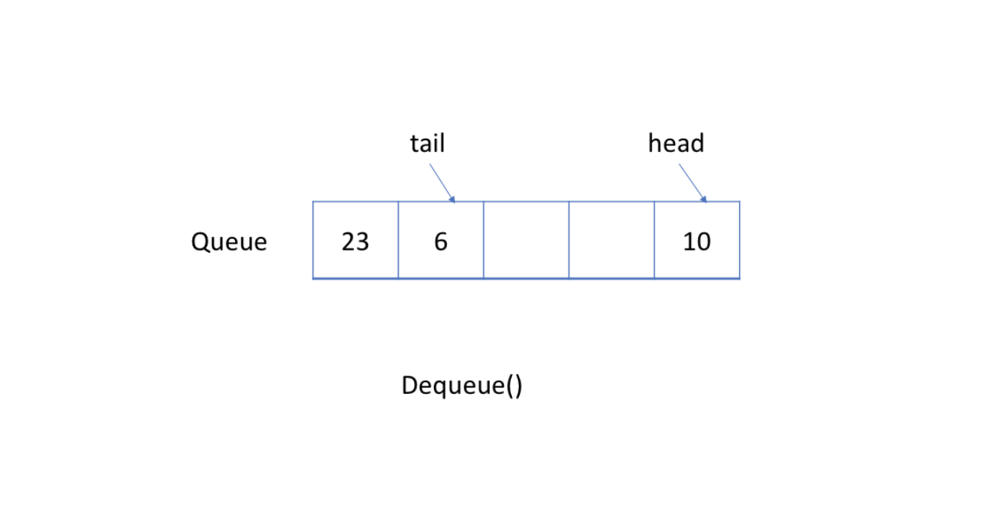

# Queue

## First-In First-Out Data Structure \(FIFO\)


In a FIFO data structure, `the first element added to the queue will be processed first`.

As shown in the picture above, the queue is a typical FIFO data structure. The insert operation is also called enqueue and the new element is always `added at the end of the queue`. The delete operation is called dequeue. You are only allowed to `remove the first element`.

#### Example - Queue

1. Enqueue: you can  see how a new element 6 is added to the queue.


2. Dequeue: you can see first element will be removed.


## Queue - Implementation

To implement a queue, we may use a dynamic array and an index pointing to the head of the queue.

As mentioned, a queue should support two operations: `enqueue` and `dequeue`. Enqueue appends a new element to the queue while dequeue removes the first element. So we need an index to indicate the starting point.

Here is an implementation for your reference:



```cpp
#include <iostream>

class MyQueue {
    private:
        vector<int> data;      // store elements  
        int p_start;   // a pointer to indicate the start position         
    public:
        MyQueue() 
        {
            p_start = 0;
        }
        /** Insert an element into the queue. Return true if the operation is successful. */
        bool enQueue(int x) {
            data.push_back(x);
            return true;
        }
        /** Delete an element from the queue. Return true if the operation is successful. */
        bool deQueue() {
            if (isEmpty() == true) {
                return false;
            }
            p_start++;
            return true;
        };
        /** Get the front item from the queue. */
        int Front() {
            return data[p_start];
        };
        /** Checks whether the queue is empty or not. */
        bool isEmpty()  {
            return p_start >= data.size();
        }
};

int main() {
    MyQueue q;
    q.enQueue(5);
    q.enQueue(3);
    if (!q.isEmpty()) {
        cout << q.Front() << endl;
    }
    q.deQueue();
    if (!q.isEmpty()) {
        cout << q.Front() << endl;
    }
    q.deQueue();
    if (!q.isEmpty()) {
        cout << q.Front() << endl;
    }
}
```



```java
// "static void main" must be defined in a public class.

class MyQueue {
    // store elements
    private List<Integer> data;         
    // a pointer to indicate the start position
    private int p_start;            
    public MyQueue() {
        data = new ArrayList<Integer>();
        p_start = 0;
    }
    /** Insert an element into the queue. Return true if the operation is successful. */
    public boolean enQueue(int x) {
        data.add(x);
        return true;
    };    
    /** Delete an element from the queue. Return true if the operation is successful. */
    public boolean deQueue() {
        if (isEmpty() == true) {
            return false;
        }
        p_start++;
        return true;
    }
    /** Get the front item from the queue. */
    public int Front() {
        return data.get(p_start);
    }
    /** Checks whether the queue is empty or not. */
    public boolean isEmpty() {
        return p_start >= data.size();
    }     
};

public class Main {
    public static void main(String[] args) {
        MyQueue q = new MyQueue();
        q.enQueue(5);
        q.enQueue(3);
        if (q.isEmpty() == false) {
            System.out.println(q.Front());
        }
        q.deQueue();
        if (q.isEmpty() == false) {
            System.out.println(q.Front());
        }
        q.deQueue();
        if (q.isEmpty() == false) {
            System.out.println(q.Front());
        }
    }
}
```



#### Drawback

The implementation above is straightforward but is inefficient in some cases. With the movement of the start pointer, more and more space is wasted. And it will be unacceptable when we only have a space limitation.


Let's consider a situation when we are only able to allocate an array whose maximum length is 5. Our solution works well when we have only added less than 5 elements. For example, if we only called the enqueue function four times and we want to enqueue an element 10, we will succeed.

And it is reasonable that we can not accept more enqueue request because the queue is full now. But what if we dequeue an element? 


Actually, we should be able to accept one more element in this case.

## Circular Queue

Previously, we have provided a straightforward but inefficient implementation of queue.

A more efficient way is to use a circular queue. Specifically, we may use `a fixed-size array` and `two pointers` to indicate the starting position and the ending position. And the goal is to `reuse the wasted storage` we mentioned previously.

Let's take a look at an example to see how a circular queue works. You should pay attention to the strategy we use to `enqueue` or `dequeue` an element.



### Implementation of Circular Queue



```cpp
class MyCircularQueue {
private:
    vector<int> data;
    int head;
    int tail;
    int size;
public:
    /** Initialize your data structure here. Set the size of the queue to be k. */
    MyCircularQueue(int k) {
        data.resize(k);
        head = -1;
        tail = -1;
        size = k;
    }
    
    /** Insert an element into the circular queue. Return true if the operation is successful. */
    bool enQueue(int value) {
        if (isFull()) {
            return false;
        }
        if (isEmpty()) {
            head = 0;
        }
        tail = (tail + 1) % size;
        data[tail] = value;
        return true;
    }
    
    /** Delete an element from the circular queue. Return true if the operation is successful. */
    bool deQueue() {
        if (isEmpty()) {
            return false;
        }
        if (head == tail) {
            head = -1;
            tail = -1;
            return true;
        }
        head = (head + 1) % size;
        return true;
    }
    
    /** Get the front item from the queue. */
    int Front() {
        if (isEmpty()) {
            return -1;
        }
        return data[head];
    }
    
    /** Get the last item from the queue. */
    int Rear() {
        if (isEmpty()) {
            return -1;
        }
        return data[tail];
    }
    
    /** Checks whether the circular queue is empty or not. */
    bool isEmpty() {
        return head == -1;
    }
    
    /** Checks whether the circular queue is full or not. */
    bool isFull() {
        return ((tail + 1) % size) == head;
    }
};

/**
 * Your MyCircularQueue object will be instantiated and called as such:
 * MyCircularQueue obj = new MyCircularQueue(k);
 * bool param_1 = obj.enQueue(value);
 * bool param_2 = obj.deQueue();
 * int param_3 = obj.Front();
 * int param_4 = obj.Rear();
 * bool param_5 = obj.isEmpty();
 * bool param_6 = obj.isFull();
 */
```



```java
class MyCircularQueue {
    
    private int[] data;
    private int head;
    private int tail;
    private int size;

    /** Initialize your data structure here. Set the size of the queue to be k. */
    public MyCircularQueue(int k) {
        data = new int[k];
        head = -1;
        tail = -1;
        size = k;
    }
    
    /** Insert an element into the circular queue. Return true if the operation is successful. */
    public boolean enQueue(int value) {
        if (isFull() == true) {
            return false;
        }
        if (isEmpty() == true) {
            head = 0;
        }
        tail = (tail + 1) % size;
        data[tail] = value;
        return true;
    }
    
    /** Delete an element from the circular queue. Return true if the operation is successful. */
    public boolean deQueue() {
        if (isEmpty() == true) {
            return false;
        }
        if (head == tail) {
            head = -1;
            tail = -1;
            return true;
        }
        head = (head + 1) % size;
        return true;
    }
    
    /** Get the front item from the queue. */
    public int Front() {
        if (isEmpty() == true) {
            return -1;
        }
        return data[head];
    }
    
    /** Get the last item from the queue. */
    public int Rear() {
        if (isEmpty() == true) {
            return -1;
        }
        return data[tail];
    }
    
    /** Checks whether the circular queue is empty or not. */
    public boolean isEmpty() {
        return head == -1;
    }
    
    /** Checks whether the circular queue is full or not. */
    public boolean isFull() {
        return ((tail + 1) % size) == head;
    }
}

/**
 * Your MyCircularQueue object will be instantiated and called as such:
 * MyCircularQueue obj = new MyCircularQueue(k);
 * boolean param_1 = obj.enQueue(value);
 * boolean param_2 = obj.deQueue();
 * int param_3 = obj.Front();
 * int param_4 = obj.Rear();
 * boolean param_5 = obj.isEmpty();
 * boolean param_6 = obj.isFull();
 */
```



Most popular languages provide built-in Queue library so you don't have to reinvent the wheel.

As mentioned before, the queue has two important operations, `enqueue` and `dequeue`. Besides, we should be able to `get the first element` in a queue since the first element should be processed first.



```cpp
#include <iostream>

int main() {
    // 1. Initialize a queue.
    queue<int> q;
    // 2. Push new element.
    q.push(5);
    q.push(13);
    q.push(8);
    q.push(6);
    // 3. Check if queue is empty.
    if (q.empty()) {
        cout << "Queue is empty!" << endl;
        return 0;
    }
    // 4. Pop an element.
    q.pop();
    // 5. Get the first element.
    cout << "The first element is: " << q.front() << endl;
    // 6. Get the last element.
    cout << "The last element is: " << q.back() << endl;
    // 7. Get the size of the queue.
    cout << "The size is: " << q.size() << endl;
}
```



```java
// "static void main" must be defined in a public class.
public class Main {
    public static void main(String[] args) {
        // 1. Initialize a queue.
        Queue<Integer> q = new LinkedList();
        // 2. Get the first element - return null if queue is empty.
        System.out.println("The first element is: " + q.peek());
        // 3. Push new element.
        q.offer(5);
        q.offer(13);
        q.offer(8);
        q.offer(6);
        // 4. Pop an element.
        q.poll();
        // 5. Get the first element.
        System.out.println("The first element is: " + q.peek());
        // 7. Get the size of the queue.
        System.out.println("The size is: " + q.size());
    }
}
```




#### 

