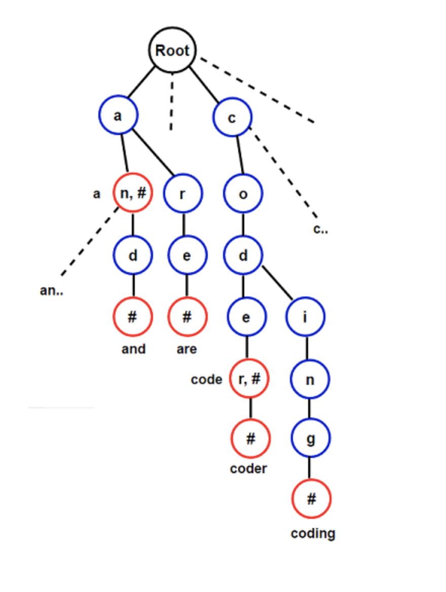

# Trie

## Trie 

### Introduction

**Trie** is a tree-based data structure, which is used for efficient retrieval of key in a large data-set of strings. Unlike a binary search tree, where a node stores the key associated with that node, the Trie node's position in the tree defines the key with which it is associated, and the key is only associated with the leaves. It is also known as **prefix tree** as all descendants of a node have a  common prefix of the string associated with that node, and the root is associated with the empty string.

### Trie Representation

There are several ways to represent a Trie, corresponding to differeent trade-offs between memory use and operations speed. The basic form is that of a linked set of nodes, where each node contains an array of child pointers, one for each symbol in the alphabet \( eg: For english, one would store 26 child pointers\). The Trie node also mantains a flag that specifies whether it corresponds to the key's end or not.

As illustrated in the following figure, each key is represented in the Trie as a path from the root to the internal node or a leaf:

### Implementation of Trie

#### Insertion

Insertion proceeds by walking the Trie according to the string to be inserted, then appending new nodes for the suffix of the string that is not contained in the Trie.

#### Searching

Searching also proceeds the similar way, like insertion, by walking the Trie according to the string to bbeb searched, returning false if the string is not found.

#### Deletion

Deletion is a bit complicated. The idea is to delete the key in a bottom-up manner using recursion. Special care has to be taken while deleting the key as it can be the prefix of another key, or its prefix can be another key in a Trie.

[Trie - C Implementation](trie-c-implementation.md)

[Trie  - C++ Implementation](trie-c++-implementation.md)

### Applications of Trie

Trie's ability to quicky search, insert and delete entries is useful at lot of applications.

#### 1. As a Replacement for other data structures

Trie has several advantages over binary search trees. It can also replace a hash table as lookup is generally faster in the Trie, even in worst case. Also, there are no collisions of different keys in a Trie, and a Trie can provide an alphabetical ordering of the entries by key.

#### 2. Autocomplete / Dictionary

A Trie's common application is storing a predictive text or autocomplete dictionaries, such as found on a mobile telephone or search engines. Autocomplete \( or word completion\) is a feature in which an application predicts the rest of a word the user is typing.

#### 3. Spell Checker

The spell checker flags words in a document that may not be spelled correctly. Spell checkers are commonly used in word precessors, email clients, search engines etc.

#### 4. Lexicographic sorting of set of keys

Lexicographic sorting of a set of keys can be accomplished with a simple Trie-based algorithm. We initially insert all keys into a Trie and then print all keys in the Trie by performing preorder traversal \( depth-first traversal\), resulting in a lexicographically increasing order.

#### 5. Longest prefix matching

Routers use the longest prefix match algorithm in Internet Protocol \(IP\) networking to select an entry from their forwarding table.

